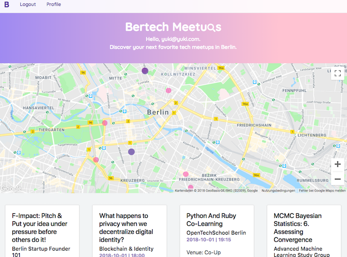

## Berlin Tech Meetups Explorer

my final project at Ironhack Berlin 2018

## Deployment

This setup is ready to deploy to Heroku. Simply connect your github repository to Heroku and trigger a deployment or activate automatic deployments.

Do not forget to install the mlab plugin in Heroku.
